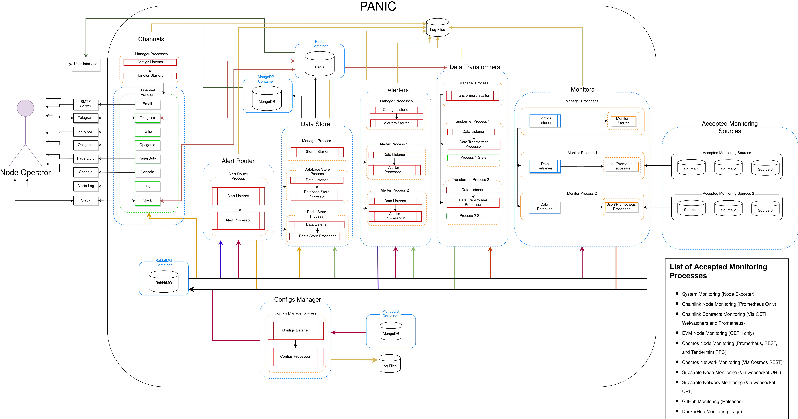

# Design and Features of PANIC

- [Design and Features of PANIC](#design-and-features-of-panic)
- [High-Level Design](#high-level-design)
- [Alert Types](#alert-types)
- [Alerting Channels](#alerting-channels)
- [Telegram and Slack Commands](#telegram-and-slack-commands)
- [List of Alerts](#list-of-alerts)
- [System Alerts](#system-alerts)
- [Chainlink Node Alerts](#chainlink-node-alerts)
- [Chainlink Contract Alerts](#chainlink-contract-alerts)
- [EVM Node Alerts](#evm-node-alerts)
- [Cosmos Node Alerts](#cosmos-node-alerts)
- [Cosmos Network Alerts](#cosmos-network-alerts)
- [GitHub Repository Alerts](#github-repository-alerts)
- [DockerHub Repository Alerts](#dockerhub-repository-alerts)

## High-Level Design

The PANIC alerter can alert a node operator on the following sources: 
- The host systems that the Cosmos-SDK/Substrate/Chainlink nodes are running on based on system metrics obtained from the node via [Node Exporter](https://github.com/prometheus/node_exporter).
- Chainlink nodes will be monitored through their Prometheus metrics.
- Chainlink contracts are monitored through the use of EVM nodes and Chainlink node addresses.
- EVM nodes will be monitored through the RPC endpoint.
- Cosmos nodes will be monitored through their Prometheus metrics, REST, and Tendermint RPC.
- Cosmos networks will be monitored using various Cosmos nodes' REST endpoint.
- GitHub repository releases using the [GitHub Releases API](https://docs.github.com/en/free-pro-team@latest/rest/reference/repos#releases).
- DockerHub repository releases using the [Docker HUB API](https://docs.docker.com/docker-hub/api/latest).

Given the above, systems monitoring and GitHub/DockerHub repositories monitoring were developed as general as possible to give the node operator the option to monitor any system and/or any repository (Don't have to be Substrate/Cosmos-SDK/Chainlink based nodes/repositories).

The diagram below depicts the different components which constitute PANIC and how they interact with each other and the node operator.

PANIC starts by loading the configurations (saved during [installation](../README.md)).

For system monitoring and alerting, PANIC operates as follows:
- When the **Monitors Manager Process** receives the configurations, it starts as many **System Monitors** as there are systems to be monitored.
- Each **System Monitor** extracts the system data from the node's Node Exporter endpoint and forwards this data to the **System Data Transformer** via **RabbitMQ**.
- The **System Data Transformer** starts by listening for data from the **System Monitors** via **RabbitMQ**. Whenever a system's data is received, the **System Data Transformer** combines the received data with the system's state obtained from **Redis**, and sends the combined data to the **Data Store** and the **System Alerter** via RabbitMQ.
- The **System Alerter** starts by listening for data from the **System Data Transformer** via **RabbitMQ**. Whenever a system's transformed data is received, the **System Alerter** compares the received data with the alert rules set during installation, and raises an alert if any of these rules are triggered. This alert is then sent to the **Alert Router** via **RabbitMQ** .
- The **Data Store** also receives data from the **System Data Transformer** via **RabbitMQ** and saves this data to both **Redis** and **MongoDB** as required.
- When the **Alert Router** receives an alert from the **System Alerter** via **RabbitMQ**, it checks the configurations to determine which channels should receive this alert. As a result, this alert is then routed to the appropriate channel and the **Data Store** (so that the alert is stored in a **Mongo** database) via **RabbitMQ**.
- When a **Channel Handler** receives an alert via **RabbitMQ**, it simply forwards it to the channel it handles and the **Node Operator** would be notified via this channel.
- If the user sets-up a **Telegram** or **Slack** Channel with **Commands** enabled, the user would be able to control and query PANIC via Telegram Bot/Slack App Commands. A list of available commands is given [here](#telegram-and-slack-commands).

For the EVM Node, Cosmos Node, and GitHub/DockerHub repositories monitoring and alerting PANIC operates similarly to the above. The difference is that each monitorable type has its own set of dedicated processes which monitor different endpoints/data sources as required. For example, to monitor Cosmos nodes a Cosmos Node Monitor, Cosmos Node Data Transformer and a Cosmos Node Alerter were written to monitor data obtained from the REST, prometheus and Tendermint-RPC endpoints.

For Chainlink node monitoring and alerting, PANIC operates as follows:
- When the **Monitors Manager Process** receives the configurations, it starts as many **Chainlink Node Monitors** as there are Chainlink configurations to be monitored. A Chainlink configuration could have multiple prometheus data points setup as a node operator would have multiple Chainlink nodes setup but one running. If one Chainlink node goes down another would start operating to ensure fully functional operations. The node monitor is built to consider this and checks all prometheus data points to find the active one, if none are found an appropriate response is passed on.
- Each **Chainlink Node Monitor** extracts the Chainlink data from the node's prometheus endpoint and forwards this data to the **Chainlink Data Transformer** via **RabbitMQ**.
- The **Chainlink Node Data Transformer** starts by listening for data from the **Chainlink Node Monitors** via **RabbitMQ**. Whenever a Chainlink node's data is received, the **Chainlink Node Data Transformer** combines the received data with the Chainlink node's state obtained from **Redis**, and sends the combined data to the **Data Store** and the **Chainlink Node Alerter** via RabbitMQ.
- The **Chainlink Node Alerter** starts by listening for data from the **Chainlink Node Data Transformer** via **RabbitMQ**. Whenever a Chainlink node's transformed data is received, the **Chainlink Node Alerter** compares the received data with the alert rules set during installation, and raises an alert if any of these rules are triggered. This alert is then sent to the **Alert Router** via **RabbitMQ** .
- The **Data Store** also received data from the **Chainlink Node Data Transformer** via **RabbitMQ** and saves this data to both **Redis** and **MongoDB** as required.
- When the **Alert Router** receives an alert from the **Chainlink Node Alerter** via **RabbitMQ**, it checks the configurations to determine which channels should receive this alert. As a result, this alert is then routed to the appropriate channel and the **Data Store** (so that the alert is stored in a **Mongo** database) via **RabbitMQ**.
- When a **Channel Handler** receives an alert via **RabbitMQ**, it simply forwards it to the channel it handles and the **Node Operator** would be notified via this channel.
- If the user sets-up a **Telegram** or **Slack** Channel with **Commands** enabled, the user would be able to control and query PANIC via Telegram Bot/Slack App Commands. A list of available commands is given [here](#telegram-and-slack-commands).

For Chainlink contract monitoring and alerting, PANIC operates as follows:
- When the **Monitors Manager Process** receives the configurations, it starts one **Chainlink Contract Monitor** per chain and keeps the configurations updated. A Chainlink Contract monitor uses EVM nodes to retrieve price feed data. The Chainlink contract monitor knows which  contracts to monitor as it retrieves the address of the Chainlink nodes previously setup and checks if the addresses exist in the list of contracts from `weiwatchers`. If a users has multiple EVM nodes setup and one goes down the monitor will attempt to retrieve data from the next node in the list, if none are reachable an appropriate message is passed on.
- Each **Chainlink Contract Monitor** extracts the Chainlink contract data from the EVM node's rpc endpoint and forwards this data to the **Chainlink Contract Data Transformer** via **RabbitMQ**.
- The **Chainlink Contract Data Transformer** starts by listening for data from the **Chainlink Contract Monitors** via **RabbitMQ**. Whenever a Chainlink contract's data is received, the **Chainlink Contract Data Transformer** combines the received data with the Chainlink contract's state obtained from **Redis**, and sends the combined data to the **Data Store** and the **Chainlink Contract Alerter** via RabbitMQ.
- The **Chainlink Contract Alerter** starts by listening for data from the **Chainlink Contract Data Transformer** via **RabbitMQ**. Whenever a Chainlink contract's transformed data is received, the **Chainlink Contract Alerter** compares the received data with the alert rules set during installation, and raises an alert if any of these rules are triggered. This alert is then sent to the **Alert Router** via **RabbitMQ** .
- The **Data Store** also received data from the **Chainlink Contract Data Transformer** via **RabbitMQ** and saves this data to both **Redis** and **MongoDB** as required.
- When the **Alert Router** receives an alert from the **Chainlink Contract Alerter** via **RabbitMQ**, it checks the configurations to determine which channels should receive this alert. As a result, this alert is then routed to the appropriate channel and the **Data Store** (so that the alert is stored in a **Mongo** database) via **RabbitMQ**.
- When a **Channel Handler** receives an alert via **RabbitMQ**, it simply forwards it to the channel it handles and the **Node Operator** would be notified via this channel.
- If the user sets-up a **Telegram** or **Slack** Channel with **Commands** enabled, the user would be able to control and query PANIC via Telegram Bot/Slack App Commands. A list of available commands is given [here](#telegram-and-slack-commands).

For Cosmos network monitoring and alerting, PANIC operates as follows:
- When the **Monitors Manager Process** receives the configurations, it starts one **Cosmos Network Monitor** per chain and keeps the configurations updated. A Cosmos Network monitor uses Cosmos nodes to retrieve governance data. If a user has multiple Cosmos nodes setup and one goes down, the monitor will attempt to retrieve data from the next node in the list. If no node is synced and reachable, an appropriate message is passed on.
- Each **Cosmos Network Monitor** extracts the Cosmos network data from the Cosmos node's REST endpoint and forwards this data to the **Cosmos Network Data Transformer** via **RabbitMQ**.
- The **Cosmos Network Data Transformer** starts by listening for data from the **Cosmos Network Monitors** via **RabbitMQ**. Whenever a Cosmos network's data is received, the **Cosmos Network Data Transformer** combines the received data with the Cosmos network's state obtained from **Redis**, and sends the combined data to the **Data Store** and the **Cosmos Network Alerter** via RabbitMQ.
- The **Cosmos Network Alerter** starts by listening for data from the **Cosmos Network Data Transformer** via **RabbitMQ**. Whenever a Cosmos network's transformed data is received, the **Cosmos Network Alerter** compares the received data with the alert rules set during installation, and raises an alert if any of these rules are triggered. This alert is then sent to the **Alert Router** via **RabbitMQ** .
- The **Data Store** also received data from the **Cosmos Network Data Transformer** via **RabbitMQ** and saves this data to both **Redis** and **MongoDB** as required.
- When the **Alert Router** receives an alert from the **Cosmos Network Alerter** via **RabbitMQ**, it checks the configurations to determine which channels should receive this alert. As a result, this alert is then routed to the appropriate channel and the **Data Store** (so that the alert is stored in a **Mongo** database) via **RabbitMQ**.
- When a **Channel Handler** receives an alert via **RabbitMQ**, it simply forwards it to the channel it handles and the **Node Operator** would be notified via this channel.
- If the user sets-up a **Telegram** or **Slack** Channel with **Commands** enabled, the user would be able to control and query PANIC via Telegram Bot/Slack App Commands. A list of available commands is given [here](#telegram-and-slack-commands).

**Notes**: 

- In future releases, the node operator will be able to use PANIC to monitor Substrate based nodes and get alerts based on blockchain-specific metrics obtained from various data sources.
- Another important component which is not depicted above is the **Health-Checker** component. The **Health-Checker** was not included in the image above as it is not part of the monitoring and alerting process, in fact it runs in its own Docker container. The **Health-Checker** component constitutes of two separate components, the **Ping Publisher** and the **Heartbeat Handler**. The **Ping Publisher** sends ping requests to PANIC's components every 30 seconds via **RabbitMQ**, and the **Heartbeat Handler** listens for heartbeats and saves them to **Redis**. This mechanism makes it possible to deduce whether PANIC's components are running as expected when the node operator enters the `/status` command described [here](#telegram-and-slack-commands).

## Alert Types

Different events vary in severity. We cannot treat an alert for a new version of the Cosmos-SDK as being on the same level as an alert for 100% Storage usage. PANIC makes use of four alert types:

- **CRITICAL**: Alerts of this type are the most severe. Such alerts are raised to inform the node operator of a situation which requires immediate action. **Example**: System's storage usage reached 100%.
- **WARNING**: A less severe alert type but which still requires attention as it may be a warning of an incoming critical alert. **Example**: System's storage usage reached 85%.
- **INFO**: Alerts of this type have little to zero severity but consists of information which is still important to acknowledge. Info alerts also include positive events. **Example**: System's storage usage is no longer at a critical level.
- **ERROR**: Alerts of this type are triggered by abnormal events and ranges from zero to high severity based on the error that has occurred and how many times it is triggered. **Example**: Cannot access GitHub page alert.

**Note:** The critical and warning values (100% and 85%) mentioned in the examples above are configurable, and these can be configured using the installation procedure mentioned [here](../README.md)

## Alerting Channels

PANIC supports multiple alerting channels. By default, only the console and logging channels are enabled, allowing the node operator to run the alerter without having to set up extra alerting channels. This is not enough for a more serious and longer-term alerting setup, for which the node operator should set up the remaining alerting channels using the installation process described [here](../README.md).

PANIC supports the following alerting channels:

| Channel     | Severities Supported                   | Configurable Severities | Description                                                                                                                                                                           |
|-------------|----------------------------------------|-------------------------|---------------------------------------------------------------------------------------------------------------------------------------------------------------------------------------|
| `Console`   | `INFO`, `CRITICAL`, `WARNING`, `ERROR` | All                     | Alerts printed to standard output (`stdout`) of the alerter's Docker container.                                                                                                       |
| `Log`       | `INFO`, `CRITICAL`, `WARNING`, `ERROR` | All                     | Alerts logged to an alerts log (`alerter/logs/alerts/alerts.log`).                                                                                                                    |
| `Telegram`  | `INFO`, `CRITICAL`, `WARNING`, `ERROR` | All                     | Alerts delivered to a Telegram chat via a Telegram bot in the form of a text message.                                                                                                 |
| `Slack`     | `INFO`, `CRITICAL`, `WARNING`, `ERROR` | All                     | Alerts delivered to a Slack channel via a Slack app in the form of a text message.                                                                                                    |
| `E-mail`    | `INFO`, `CRITICAL`, `WARNING`, `ERROR` | All                     | Alerts sent as emails using an SMTP server, with option for authentication.                                                                                                           |
| `Twilio`    | `CRITICAL`                             | None                    | Alerts trigger a phone call to grab the node operator's attention.                                                                                                                    |
| `Opsenie`   | `INFO`, `CRITICAL`, `WARNING`, `ERROR` | All                     | Alerts are sent to the node operator's Opsgenie environment using the following severity mapping: `CRITICAL` → `P1`, `WARNING` → `P3`, `ERROR` → `P3`, `INFO` → `P5`                  |
| `PagerDuty` | `INFO`, `CRITICAL`, `WARNING`, `ERROR` | All                     | Alerts are sent to the node operator's PagerDuty environment using the following severity mapping: `CRITICAL` → `critical`, `WARNING` → `warning`, `ERROR` → `error`, `INFO` → `info` |

Using the installation procedure, the user is able to specify the chain a node/system/GitHub repository belongs to (if the system/GitHub repository is not associated with a chain, it is associated automatically under the GENERAL chain). Due to this, the user is given the capability of associating channels with specific chains, hence obtaining a more organized alerting system. In addition to this, the user can set multiple alerting channels of the same type and enable/disable alert severities on each channel.

For example the node operator may have the following setup:
- A Telegram Channel for Polkadot alerts with only WARNING and CRITICAL alerts enabled.
- A Telegram Channel for Cosmos alerts with all severities enabled.
- A Twilio Channel for all chains added to PANIC.

## Telegram and Slack Commands

Telegram bots and Slack apps in PANIC serve two purposes. As mentioned above, they are used to send alerts. However they can also accept commands, allowing the node operator to have some control over the alerter and check its status.

PANIC supports the following commands:

| Command                                         | Parameters                                                | Description                                                                                                                                                                                                                                                                                                                                                                                                                                 |
|-------------------------------------------------|-----------------------------------------------------------|---------------------------------------------------------------------------------------------------------------------------------------------------------------------------------------------------------------------------------------------------------------------------------------------------------------------------------------------------------------------------------------------------------------------------------------------|
| `/start`                                        | None                                                      | A welcome message is returned.                                                                                                                                                                                                                                                                                                                                                                                                              |
| `/ping`                                         | None                                                      | Pings the Telegram/Slack Commands Handler associated with the Telegram Chat/Slack Channel and returns `PONG!`. The user can use this command to check that the associated Telegram/Slack Commands Handler is running.                                                                                                                                                                                                                       |
| `/help`                                         | None                                                      | Returns a guide of acceptable commands and their description.                                                                                                                                                                                                                                                                                                                                                                               |
| `/mute` for Telegram `/panicmute` for Slack     | List of severities, for example: `/mute INFO CRITICAL`    | Suppose that the user types `/mute INFO CRITICAL` in a Telegram Chat/Slack Channel associated with the chain `Polkadot`. The `/mute` command mutes `INFO` and `CRITICAL` alerts on all channels (Including all other channels which are set-up, for example Opsgenie) for the chain `Polkadot`. If no severities are given, all `Polkadot` alerts are muted on all channels.                                                                |
| `/unmute`                                       | None                                                      | Suppose that the user types `/unmute` in a Telegram Chat/Slack Channel associated with the chain `Polkadot`. This command will unmute all alert severities on all channels (Including all other channels which are set-up ex. Opsgenie) for the chain `Polkadot`.                                                                                                                                                                           |
| `/muteall`                                      | List of severities, for example: `/muteall INFO CRITICAL` | Suppose that the user types `/muteall INFO CRITICAL` in a Telegram Chat/Slack Channel associated with the chain `Polkadot`. The `/muteall` command mutes `INFO` and `CRITICAL` alerts on all channels (Including all other channels which are set-up, for example Opsgenie) for every chain being monitored (including the GENERAL chain). If no severities are given, all alerts for all chains being monitored are muted on all channels. |
| `/unmuteall`                                    | None                                                      | Suppose that the user types `/unmuteall` in a Telegram Chat/Slack Channel associated with the chain `Polkadot`. This command unmutes all alert severities on all channels (Including all other channels which are set-up ex. Opsgenie) for every chain being monitored (including the GENERAL chain).                                                                                                                                       |
| `/status` for Telegram `/panicstatus` for Slack | None                                                      | Returns whether the components that constitute PANIC are running or not. If there are problems, the problems are highlighted in the status message.                                                                                                                                                                                                                                                                                         |

## List of Alerts

A complete list of alerts will now be presented. These are grouped into:
+ [System Alerts](#system-alerts)
+ [Chainlink Node Alerts](#chainlink-node-alerts)
+ [Chainlink Contract Alerts](#chainlink-contract-alerts)
+ [EVM Node Alerts](#evm-node-alerts)
+ [Cosmos Node Alerts](#cosmos-node-alerts)
+ [Cosmos Network Alerts](#cosmos-network-alerts)
+ [GitHub Repository Alerts](#github-repository-alerts)
+ [DockerHub Repository Alerts](#dockerhub-repository-alerts)

Each alert has either severity thresholds associated, or is associated a single severity. A severity threshold is a (`value`, `severity`) pair such that when a metric associated with the alert reaches `value`, an alert with `severity` is raised. For example, the `System CPU Usage Critical` severity threshold can be configured to `95%`, meaning that you will get a `CRITICAL` `SystemCPUUsageIncreasedAboveThresholdAlert` alert if the `CPU Usage` of a system reaches `95%`. On the other hand, if an alert is associated a single severity, that alert will always be raised with the same severity whenever the alert rule is obeyed. For example, when a System is back up again after it was down, a `SystemBackUpAgainAlert` with severity `INFO` is raised. In addition to this, not all alerts have their severities or severity thresholds configurable, also some alerts can be even disabled altogether.

In the lists below we will show which alerts have severity thresholds and which alerts have a single severity associated. In addition to this we will state which alerts are configurable/non-configurable and which can be disabled/enabled.

**Note**: Alerts can be configured and/or enabled/disabled using the installation procedure described [here](../README.md)

## System Alerts

| Alert Class                                       | Severity Thresholds   | Severity | Configurable |      Can be Enabled/Disabled       | Description                                                                                                                                                                                                                                                                                                                                       |
|---------------------------------------------------|-----------------------|----------|:------------:|:----------------------------------:|---------------------------------------------------------------------------------------------------------------------------------------------------------------------------------------------------------------------------------------------------------------------------------------------------------------------------------------------------|
| `SystemWentDownAtAlert`                           | `WARNING`, `CRITICAL` |          |      ✓       |                 ✓                  | A `WARNING`/`CRITICAL` alert is raised if `warning_threshold`/`critical_threshold` seconds pass after a system is down respectively.                                                                                                                                                                                                              |
| `SystemBackUpAgainAlert`                          |                       | `INFO`   |      ✗       | Depends on `SystemWentDownAtAlert` | The system was down and is back up again. This alert can only be enabled/disabled if the downtime alert is enabled/disabled respectively.                                                                                                                                                                                                         |
| `SystemStillDownAlert`                            | `CRITICAL`            |          |      ✓       |                 ✓                  | Raised periodically every `critical_repeat` seconds if a `SystemWentDownAt` alert has already been raised.                                                                                                                                                                                                                                        |
| `InvalidUrlAlert`                                 |                       | `ERROR`  |      ✗       |                 ✗                  | The system's provided Node Exporter endpoint has an invalid URL schema.                                                                                                                                                                                                                                                                           |
| `ValidUrlAlert`                                   |                       | `INFO`   |      ✗       |                 ✗                  | The system's provided Node Exporter endpoint is valid after being invalid.                                                                                                                                                                                                                                                                        |
| `MetricNotFoundErrorAlert`                        |                       | `ERROR`  |      ✗       |                 ✗                  | A metric that is being monitored cannot be found at the system's Node Exporter endpoint.                                                                                                                                                                                                                                                          |
| `MetricFoundAlert`                                |                       | `INFO`   |      ✗       |                 ✗                  | All metrics can be found at the system's Node Exporter endpoint after a `MetricNotFoundErrorAlert` is raised.                                                                                                                                                                                                                                     |
| `OpenFileDescriptorsIncreasedAboveThresholdAlert` | `WARNING`, `CRITICAL` |          |      ✓       |                 ✓                  | A `WARNING`/`CRITICAL` alert is raised if the percentage number of open file descriptors increases above `warning_threshold`/`critical_threshold` respectively. This alert is raised periodically every `critical_repeat` seconds with `CRITICAL` severity if the percentage number of open file descriptors is still above `critical_threshold`. |
| `OpenFileDescriptorsDecreasedBelowThresholdAlert` |                       | `INFO`   |      ✗       |                 ✗                  | The percentage number of open file descriptors decreases below `warning_threshold`/`critical_threshold`. This alert can only be enabled/disabled if the `OpenFileDescriptorsIncreasedAboveThresholdAlert` is enabled/disabled respectively.                                                                                                       |
| `SystemCPUUsageIncreasedAboveThresholdAlert`      | `WARNING`, `CRITICAL` |          |      ✓       |                 ✓                  | A `WARNING`/`CRITICAL` alert is raised if the system's CPU usage percentage increases above `warning_threshold`/`critical_threshold` respectively. This alert is raised periodically every `critical_repeat` seconds with `CRITICAL` severity if the system's CPU usage percentage is still above `critical_threshold`.                           |
| `SystemCPUUsageDecreasedBelowThresholdAlert`      |                       | `INFO`   |      ✗       |                 ✗                  | The system's CPU usage percentage decreases below `warning_threshold`/`critical_threshold`. This alert can only be enabled/disabled if the `SystemCPUUsageIncreasedAboveThresholdAlert` is enabled/disabled respectively.                                                                                                                         |
| `SystemRAMUsageIncreasedAboveThresholdAlert`      | `WARNING`, `CRITICAL` |          |      ✓       |                 ✓                  | A `WARNING`/`CRITICAL` alert is raised if the system's RAM usage percentage increases above `warning_threshold`/`critical_threshold` respectively. This alert is raised periodically every `critical_repeat` seconds with `CRITICAL` severity if the system's RAM usage percentage is still above `critical_threshold`.                           |
| `SystemRAMUsageDecreasedBelowThresholdAlert`      |                       | `INFO`   |      ✗       |                 ✗                  | The system's RAM usage percentage decreases below `warning_threshold`/`critical_threshold`. This alert can only be enabled/disabled if the `SystemRAMUsageIncreasedAboveThresholdAlert` is enabled/disabled respectively.                                                                                                                         |
| `SystemStorageUsageIncreasedAboveThresholdAlert`  | `WARNING`, `CRITICAL` |          |      ✓       |                 ✓                  | A `WARNING`/`CRITICAL` alert is raised if the system's storage usage percentage increases above `warning_threshold`/`critical_threshold` respectively. This alert is raised periodically every `critical_repeat` seconds with `CRITICAL` severity if the system's storage usage percentage is still above `critical_threshold`.                   |
| `SystemStorageUsageDecreasedBelowThresholdAlert`  |                       | `INFO`   |      ✗       |                 ✗                  | The system's storage usage percentage decreases below `warning_threshold`/`critical_threshold`. This alert can only be enabled/disabled if the `SystemStorageUsageIncreasedAboveThresholdAlert` is enabled/disabled respectively.                                                                                                                 |

**Note:** 
- `warning_threshold` and `critical_threshold` represent the `WARNING` and `CRITICAL` configurable thresholds respectively. These are set by the user during installation.
- `critical_repeat` represents the amount of time that needs to pass for a `CRITICAL` alert that has already been raised to be raised again. This can also be set by the user during installation.

## Chainlink Node Alerts

| Alert Class                                        | Severity Thresholds  | Severity   | Configurable |                    Can be Enabled/Disabled                    | Description                                                                                                                                                         |
|----------------------------------------------------|----------------------|------------|:------------:|:-------------------------------------------------------------:|---------------------------------------------------------------------------------------------------------------------------------------------------------------------|
| `NoChangeInHeightAlert`                            | `WARNING`,`CRITICAL` |            |      ✓       |                               ✓                               | There is no change in height for `warning` and `critical` time thresholds.                                                                                          |
| `BlockHeightUpdatedAlert`                          |                      | `INFO`     |      ✗       |              Depends on `NoChangeInHeightAlert`               | There is a change in height after `warning` or `critical` alerts of type `NoChangeInHeightAlert` have been raised.                                                  |
| `NoChangeInTotalHeadersReceivedAlert`              | `WARNING`,`CRITICAL` |            |      ✓       |                               ✓                               | There is no change in total headers received for `warning` and `critical` time thresholds.                                                                          |
| `ReceivedANewHeaderAlert`                          |                      | `INFO`     |      ✗       |       Depends on `NoChangeInTotalHeadersReceivedAlert`        | There is a change in total headers received after `warning` or `critical` alerts of type `NoChangeInTotalHeadersReceivedAlert` have been raised.                    |
| `MaxUnconfirmedBlocksIncreasedAboveThresholdAlert` | `WARNING`,`CRITICAL` |            |      ✓       |                               ✓                               | The number of max unconfirmed blocks passed `warning` or `critical` block amounts thresholds.                                                                       |
| `MaxUnconfirmedBlocksDecreasedBelowThresholdAlert` |                      | `INFO`     |      ✗       | Depends on `MaxUnconfirmedBlocksDecreasedBelowThresholdAlert` | The amount of max unconfirmed blocks which were previously above `warning` or `critical` thresholds are now below them.                                             |
| `ChangeInSourceNodeAlert`                          |                      | `WARNING`  |      ✓       |                               ✓                               | Node goes down and another node takes it's place and begins operating.                                                                                              |
| `GasBumpIncreasedOverNodeGasPriceLimitAlert`       |                      | `CRITICAL` |      ✓       |                               ✓                               | The gas bump increases over the node gas price limit. This alert doesn't repeat and only alerts once per instance of increase.                                      |
| `NoOfUnconfirmedTxsIncreasedAboveThresholdAlert`   | `WARNING`,`CRITICAL` |            |      ✓       |                               ✓                               | The number of unconfirmed transactions being sent by the node have surpassed `warning` or `critical` thresholds.                                                    |
| `NoOfUnconfirmedTxsDecreasedBelowThresholdAlert`   |                      | `INFO`     |      ✗       |  Depends on `NoOfUnconfirmedTxsIncreasedAboveThresholdAlert`  | The number of unconfirmed transactions have decreased below `warning` or `critical` thresholds.                                                                     |
| `TotalErroredJobRunsIncreasedAboveThresholdAlert`  | `WARNING`,`CRITICAL` |            |      ✓       |                               ✓                               | The number of total errored job runs increased above `warning` or `critical` thresholds.                                                                            |
| `TotalErroredJobRunsDecreasedBelowThresholdAlert`  |                      | `INFO`     |      ✗       | Depends on `TotalErroredJobRunsIncreasedAboveThresholdAlert`  | The number of total errored jobs run decreases below `warning` or `critical` thresholds.                                                                            |
| `EthBalanceIncreasedAboveThresholdAlert`           |                      | `INFO`     |      ✓       |      Depends on `EthBalanceDecreasedBelowThresholdAlert`      | The Ethereum balance increases above `warning` or `critical` thresholds.                                                                                            |
| `EthBalanceDecreasedBelowThresholdAlert`           | `WARNING`,`CRITICAL` |            |      ✓       |                               ✓                               | The Ethereum balance decreases below `warning` or `critical` thresholds`.                                                                                           |
| `EthBalanceToppedUpAlert`                          |                      | `INFO`     |      ✓       |                               ✓                               | The Ethereum balance is topped up this alert is raised.                                                                                                             |
| `InvalidUrlAlert`                                  |                      | `ERROR`    |      ✗       |                               ✗                               | The URL is unreachable most likely due to an invalid configuration.                                                                                                 |
| `ValidUrlAlert`                                    |                      | `INFO`     |      ✗       |                               ✗                               | The monitors manage to connect to a valid URL.                                                                                                                      |
| `PrometheusSourceIsDownAlert`                      |                      | `WARNING`  |      ✗       |                               ✗                               | The URL given for the prometheus endpoint is unreachable.                                                                                                           |
| `PrometheusSourceBackUpAgainAlert`                 |                      | `INFO`     |      ✗       |                               ✗                               | The URL given for the prometheus endpoint is now reachable after being unreachable.                                                                                 |
| `NodeWentDownAtAlert`                              | `WARNING`,`CRITICAL` |            |      ✓       |                               ✓                               | All endpoints of a node are unreachable, classifying the node as down.                                                                                              |
| `NodeBackUpAgainAlert`                             |                      | `INFO`     |      ✗       |               Depends on `NodeWentDownAtAlert`                | Valid endpoints have been found meaning that the node is now reachable.                                                                                             |
| `NodeStillDownAlert`                               |                      | `CRITICAL` |      ✓       |            ✓ but depends on `NodeWentDownAtAlert`             | If a node has been classified as down for sometime this alert will keep repeating for a period until it is back up again.                                           |
| `MetricNotFoundErrorAlert`                         |                      | `ERROR`    |      ✗       |                               ✗                               | The endpoint had it's prometheus data changed therefore PANIC cannot find the correct metrics to read. Either the wrong endpoint was given or PANIC needs updating. |
| `MetricFoundAlert`                                 |                      | `INFO`     |      ✗       |                               ✗                               | This is raised when the `MetricNotFoundErrorAlert` was raised for whatever reason and now PANIC has managed to locate the metric at the prometheus endpoint.        |

## Chainlink Contract Alerts

| Alert Class                                          | Severity Thresholds  | Severity  | Configurable |                     Can be Enabled/Disabled                     | Description                                                                         |
|------------------------------------------------------|----------------------|-----------|:------------:|:---------------------------------------------------------------:|-------------------------------------------------------------------------------------|
| `PriceFeedObservationsMissedIncreasedAboveThreshold` | `WARNING`,`CRITICAL` |           |      ✓       |                                ✓                                | The number of missed price feed observations increased above thresholds.            |
| `PriceFeedObservedAgain`                             | `INFO`               |           |      ✗       | Depends on `PriceFeedObservationsMissedIncreasedAboveThreshold` | A Chainlink node starts to observe price feeds again.                               |
| `PriceFeedDeviationInreasedAboveThreshold`           | `WARNING`,`CRITICAL` |           |      ✓       |                                ✓                                | The price feed observation submitted deviates from the consensus above thresholds.  |
| `PriceFeedDeviationDecreasedBelowThreshold`          | `INFO`               |           |      ✗       |      Depends on `PriceFeedDeviationInreasedAboveThreshold`      | The Chainlink node's price feed submissions are no longer deviating from consensus. |
| `ConsensusFailure`                                   |                      | `WARNING` |      ✗       |                                ✓                                | The price feed our Chainlink node submits to doesn't reach a consensus.             |
| `ErrorContractsNotRetrieved`                         |                      | `ERROR`   |      ✗       |                                ✗                                | Weiwatchers isn't available therefore contracts cannot be retrieved.                |
| `ContractsNowRetrieved`                              |                      | `INFO`    |      ✗       |                                ✗                                | Weiwatchers is available again therefore contracts can be retrieved.                |
| `ErrorNoSyncedDataSources`                           |                      | `ERROR`   |      ✗       |                                ✗                                | No EVM nodes are available to retrieve data from.                                   |
| `SyncedDataSourcesFound`                             |                      | `INFO`    |      ✗       |                                ✗                                | Synced EVM nodes are found and contract data can be retrieved again.                |

## EVM Node Alerts

| Alert Class                                         | Severity Thresholds  | Severity | Configurable |                    Can be Enabled/Disabled                     | Description                                                                        |
|-----------------------------------------------------|----------------------|----------|:------------:|:--------------------------------------------------------------:|------------------------------------------------------------------------------------|
| `NoChangeInBlockHeight`                             | `WARNING`,`CRITICAL` |          |      ✓       |                               ✓                                | There hasn't been a change in node block height over a period of time.             |
| `BlockHeightUpdatedAlert`                           | `INFO`               |          |      ✗       |               Depends on `NoChangeInBlockHeight`               | EVM node starts to update it's block height.                                       |
| `BlockHeightDifferenceIncreasedAboveThresholdAlert` | `WARNING`,`CRITICAL` |          |      ✓       |                               ✓                                | The block height difference between multiple EVM nodes increased above thresholds. |
| `BlockHeightDifferenceDecreasedBelowThresholdAlert` | `INFO`               |          |      ✗       | Depends on `BlockHeightDifferenceIncreasedAboveThresholdAlert` | The difference between EVM node's block heights decreased below thresholds.        |
| `InvalidUrlAlert`                                   |                      | `ERROR`  |      ✗       |                               ✗                                | EVM node URL is invalid.                                                           |
| `ValidUrlAlert`                                     |                      | `INFO`   |      ✗       |                               ✗                                | EVM node URL is found after being invalid.                                         |
| `NodeWentDownAtAlert`                               | `WARNING`,`CRITICAL` |          |      ✓       |                               ✓                                | EVM node is unreachable.                                                           |
| `NodeBackUpAgainAlert`                              | `INFO`               |          |      ✗       |                Depends on `NodeWentDownAtAlert`                | EVM node is back up again.                                                         |
| `NodeStillDownAlert`                                | `CRITICAL`           |          |      ✓       |             ✓ but depends on `NodeWentDownAtAlert`             | EVM node is still detected as down after a period of time.                         |

## Cosmos Node Alerts

| Alert Class                                         | Severity Thresholds  | Severity         | Configurable |                    Can be Enabled/Disabled                     | Description                                                                                                                                            |
|-----------------------------------------------------|----------------------|------------------|:------------:|:--------------------------------------------------------------:|--------------------------------------------------------------------------------------------------------------------------------------------------------|
| `NodeWentDownAtAlert`                               | `WARNING`,`CRITICAL` |                  |      ✓       |                               ✓                                | All endpoints of a node are unreachable, classifying the node as down.                                                                                 |
| `NodeBackUpAgainAlert`                              | `INFO`               |                  |      ✗       |                Depends on `NodeWentDownAtAlert`                | Some node endpoints are accessible again, meaning that the node is now reachable.                                                                      |
| `NodeStillDownAlert`                                | `CRITICAL`           |                  |      ✓       |             ✓ but depends on `NodeWentDownAtAlert`             | If a node has been classified as down for sometime this alert will keep repeating for a period until it is back up again.                              |
| `ValidatorWasSlashedAlert`                          |                      | `CRITICAL`       |      ✓       |                               ✓                                | Validator has been slashed.                                                                                                                            |
| `NodeIsSyncingAlert`                                |                      | `INFO`,`WARNING` |      ✓       |                               ✓                                | Node or validator is syncing.                                                                                                                          |
| `NodeIsNoLongerSyncingAlert`                        |                      | `INFO`           |      ✗       |                Depends on `NodeIsSyncingAlert`                 | Node or validator is no longer syncing.                                                                                                                |
| `ValidatorIsNotActiveAlert`                         |                      | `CRITICAL`       |      ✓       |                               ✓                                | Validator is not active in the current consensus session.                                                                                              |
| `ValidatorIsActiveAlert`                            |                      | `INFO`           |      ✗       |             Depends on `ValidatorIsNotActiveAlert`             | Validator is active in the current consensus session after not being active in a previous consensus session.                                           |
| `ValidatorIsJailedAlert`                            |                      | `CRITICAL`       |      ✓       |                               ✓                                | Validator is jailed.                                                                                                                                   |
| `ValidatorIsNoLongerJailedAlert`                    |                      | `INFO`           |      ✗       |              Depends on `ValidatorIsJailedAlert`               | Validator is no longer jailed.                                                                                                                         |
| `BlocksMissedIncreasedAboveThresholdAlert`          | `WARNING`,`CRITICAL` |                  |      ✓       |                               ✓                                | The number of missed block signatures increased above `warning` or `critical` thresholds.                                                             |
| `BlocksMissedDecreasedBelowThresholdAlert`          | `INFO`               |                  |      ✗       |     Depends on `BlocksMissedIncreasedAboveThresholdAlert`      | The number of missed block signatures decreased below `warning` or `critical` thresholds.                                                             |
| `NoChangeInHeightAlert`                             | `WARNING`,`CRITICAL` |                  |      ✓       |                               ✓                                | There hasn't been a change in node block height over a period of time.                                                                                 |
| `BlockHeightUpdatedAlert`                           | `INFO`               |                  |      ✗       |              Depends on `BlockHeightUpdatedAlert`              | Cosmos node starts to update it's block height.                                                                                                        |
| `BlockHeightDifferenceIncreasedAboveThresholdAlert` | `WARNING`,`CRITICAL` |                  |      ✓       |                               ✓                                | The block height difference between multiple Cosmos nodes increased above thresholds.                                                                  |
| `BlockHeightDifferenceDecreasedBelowThresholdAlert` | `INFO`               |                  |      ✗       | Depends on `BlockHeightDifferenceIncreasedAboveThresholdAlert` | The difference between Cosmos node's block heights decreased below thresholds.                                                                         |
| `PrometheusInvalidUrlAlert`                         |                      | `ERROR`          |      ✗       |                               ✗                                | A node's provided Prometheus endpoint has an invalid URL schema.                                                                                       |
| `PrometheusValidUrlAlert`                           |                      | `INFO`           |      ✗       |                               ✗                                | A node's provided Prometheus endpoint is valid after `PrometheusInvalidUrlAlert` is raised.                                                            |
| `CosmosRestInvalidUrlAlert`                         |                      | `ERROR`          |      ✗       |                               ✗                                | A node's provided Cosmos REST endpoint has an invalid URL schema.                                                                                      |
| `CosmosRestValidUrlAlert`                           |                      | `INFO`           |      ✗       |                               ✗                                | A node's provided Cosmos REST endpoint is valid after `CosmosRestInvalidUrlAlert` is raised.                                                           |
| `TendermintRPCInvalidUrlAlert`                      |                      | `ERROR`          |      ✗       |                               ✗                                | A node's provided Tendermint RPC endpoint has an invalid URL schema.                                                                                   |
| `TendermintRPCValidUrlAlert`                        |                      | `INFO`           |      ✗       |                               ✗                                | A node's provided Tendermint RPC endpoint is valid after `TendermintRPCInvalidUrlAlert` is raised.                                                     |
| `PrometheusSourceIsDownAlert`                       | `WARNING`,`CRITICAL` |                  |      ✓       |                               ✓                                | A node's provided Prometheus endpoint is unreachable.                                                                                                  |
| `PrometheusSourceStillDownAlert`                    | `CRITICAL`           |                  |      ✓       |         ✓ but depends on `PrometheusSourceIsDownAlert`         | If a node's Prometheus endpoint has been classified as down for sometime this alert will keep repeating for a period until it is back up again.        |
| `PrometheusSourceBackUpAgainAlert`                  | `INFO`               |                  |      ✗       |            Depends on `PrometheusSourceIsDownAlert`            | A node's provided Prometheus endpoint is no longer unreachable.                                                                                        |
| `CosmosRestSourceIsDownAlert`                       | `WARNING`,`CRITICAL` |                  |      ✓       |                               ✓                                | The node's provided Cosmos REST endpoint is unreachable.                                                                                               |
| `CosmosRestSourceStillDownAlert`                    | `CRITICAL`           |                  |      ✓       |         ✓ but depends on `CosmosRestSourceIsDownAlert`         | If a node's Cosmos REST endpoint has been classified as down for sometime this alert will keep repeating for a period until it is back up again.       |
| `CosmosRestSourceBackUpAgainAlert`                  | `INFO`               |                  |      ✗       |            Depends on `CosmosRestSourceIsDownAlert`            | A node's provided Cosmos REST endpoint is no longer unreachable.                                                                                       |
| `TendermintRPCSourceIsDownAlert`                    | `WARNING`,`CRITICAL` |                  |      ✓       |                               ✓                                | The node's provided Tendermint RPC endpoint is unreachable.                                                                                            |
| `TendermintRPCSourceStillDownAlert`                 | `CRITICAL`           |                  |      ✓       |       ✓ but depends on `TendermintRPCSourceIsDownAlert`        | If a node's Tendermint RPC endpoint has been classified as down for sometime this alert will keep repeating for a period until it is back up again.    |
| `TendermintRPCSourceBackUpAgainAlert`               | `INFO`               |                  |      ✗       |          Depends on `TendermintRPCSourceIsDownAlert`           | A node's provided Tendermint RPC endpoint is no longer unreachable.                                                                                    |
| `ErrorNoSyncedCosmosRestDataSourcesAlert`           |                      | `ERROR`          |      ✗       |                               ✗                                | No synced Cosmos node was available as a Cosmos REST data source.                                                                                      |
| `SyncedCosmosRestDataSourcesFoundAlert`             |                      | `INFO`           |      ✗       |                               ✗                                | PANIC found a Cosmos node that could act as a Cosmos REST data source again.                                                                           |
| `ErrorNoSyncedTendermintRPCDataSourcesAlert`        |                      | `ERROR`          |      ✗       |                               ✗                                | No synced Cosmos node was available as a Tendermint-RPC data source.                                                                                   |
| `SyncedTendermintRPCDataSourcesFoundAlert`          |                      | `INFO`           |      ✗       |                               ✗                                | PANIC found a Cosmos node that could act as a Tendermint-RPC data source again.                                                                        |
| `CosmosRestServerDataCouldNotBeObtainedAlert`       |                      | `ERROR`          |      ✗       |                               ✗                                | Could not obtain data from Cosmos REST for a given node.                                                                                               |
| `CosmosRestServerDataObtainedAlert`                 |                      | `INFO`           |      ✗       |                               ✗                                | Obtained data from Cosmos REST for a given node after `CosmosRestServerDataCouldNotBeObtainedAlert` is raised.                                         |
| `TendermintRPCDataCouldNotBeObtainedAlert`          |                      | `ERROR`          |      ✗       |                               ✗                                | Could not obtain data from Tendermint RPC for a given node.                                                                                            |
| `TendermintRPCDataObtainedAlert`                    |                      | `INFO`           |      ✗       |                               ✗                                | Obtained data from Tendermint RPC for a given node after `TendermintRPCDataCouldNotBeObtainedAlert` is raised.                                         |
| `MetricNotFoundErrorAlert`                          |                      | `ERROR`          |      ✗       |                               ✗                                | A node's prometheus data changed therefore PANIC cannot find the correct metrics to read. Either the wrong endpoint was given or PANIC needs updating. |
| `MetricFoundAlert`                                  |                      | `INFO`           |      ✗       |                               ✗                                | Managed to locate the metric which was previously not found at the prometheus endpoint.                                                                |

## Cosmos Network Alerts

| Alert Class                                | Severity Thresholds | Severity | Configurable | Can be Enabled/Disabled | Description                                                                                          |
|--------------------------------------------|---------------------|----------|:------------:|:-----------------------:|------------------------------------------------------------------------------------------------------|
| `NewProposalSubmittedAlert`                |                     | `INFO`   |      ✓       |            ✓            | A new proposal has been submitted to the governance forum.                                           |
| `ProposalConcludedAlert`                   |                     | `INFO`   |      ✓       |            ✓            | A governance proposal has concluded with the respective result returned.                             |
| `ErrorNoSyncedCosmosRestDataSourcesAlert`  |                     | `ERROR`  |      ✗       |            ✗            | No synced Cosmos node was available as a Cosmos REST data source.                                    |
| `SyncedCosmosRestDataSourcesFoundAlert`    |                     | `INFO`   |      ✗       |            ✗            | PANIC found a Cosmos node that could act as a Cosmos REST data source again.                         |
| `CosmosNetworkDataCouldNotBeObtainedAlert` |                     | `ERROR`  |      ✗       |            ✗            | Could not obtain network data using given nodes.                                                     |
| `CosmosNetworkDataObtainedAlert`           |                     | `INFO`   |      ✗       |            ✗            | Obtained network data using a given node after `CosmosNetworkDataCouldNotBeObtainedAlert` is raised. |

## GitHub Repository Alerts

| Alert Class                       | Severity | Configurable | Can be Enabled/Disabled | Description                                                                                                                                                                                        |
|-----------------------------------|----------|:------------:|:-----------------------:|----------------------------------------------------------------------------------------------------------------------------------------------------------------------------------------------------|
| `NewGitHubReleaseAlert`           | `INFO`   |      ✗       |            ✗            | A new release is published for a GitHub repository. Some release details are also given. Note, this alert cannot be enabled/disabled unless the operator decides to not monitor a repo altogether. |
| `CannotAccessGitHubPageAlert`     | `ERROR`  |      ✗       |            ✗            | Alerter cannot access the GitHub repository's Releases API Page.                                                                                                                                   |
| `GitHubPageNowAccessibleAlert`    | `INFO`   |      ✗       |            ✗            | Alerter is able to access the GitHub repository's Releases API Page after a `CannotAccessGitHubPageAlert` is raised.                                                                               |
| `GitHubAPICallErrorAlert`         | `ERROR`  |      ✗       |            ✗            | The GitHub releases API call fails.                                                                                                                                                                |
| `GitHubAPICallErrorResolvedAlert` | `INFO`   |      ✗       |            ✗            | Alerter no longer detects errors related to the GitHub API call.                                                                                                                                   |

## DockerHub Repository Alerts

| Alert Class                              | Severity | Configurable | Can be Enabled/Disabled | Description                                                                                                                                                                                     |
|------------------------------------------|----------|:------------:|:-----------------------:|-------------------------------------------------------------------------------------------------------------------------------------------------------------------------------------------------|
| `DockerHubNewTagAlert`                   | `INFO`   |      ✗       |            ✗            | A new tag is published for a DockerHub repository. The new tag is also given. Note, this alert cannot be enabled/disabled unless the operator decides to not monitor a repo altogether.         |
| `DockerHubUpdatedTagAlert`               | `INFO`   |      ✗       |            ✗            | An existing tag for a DockerHub repository is updated. The updated tag is also given. Note, this alert cannot be enabled/disabled unless the operator decides to not monitor a repo altogether. |
| `DockerHubDeletedTagAlert`               | `INFO`   |      ✗       |            ✗            | An existing tag for a DockerHub repository is deleted. The deleted tag is also given. Note, this alert cannot be enabled/disabled unless the operator decides to not monitor a repo altogether. |
| `CannotAccessDockerHubPageAlert`         | `ERROR`  |      ✗       |            ✗            | Alerter cannot access the DockerHub API.                                                                                                                                                        |
| `DockerHubPageNowAccessibleAlert`        | `INFO`   |      ✗       |            ✗            | Alerter is able to access the DockerHub API after a `CannotAccessDockerHubPageAlert` is raised.                                                                                                 |
| `DockerHubTagsAPICallErrorAlert`         | `ERROR`  |      ✗       |            ✗            | DockerHub Tags API call fails.                                                                                                                                                                  |
| `DockerHubTagsAPICallErrorResolvedAlert` | `INFO`   |      ✗       |            ✗            | Alerter no longer detects errors related to the DockerHub Tags API call.                                                                                                                        |

---
[Back to front page](../README.md)
