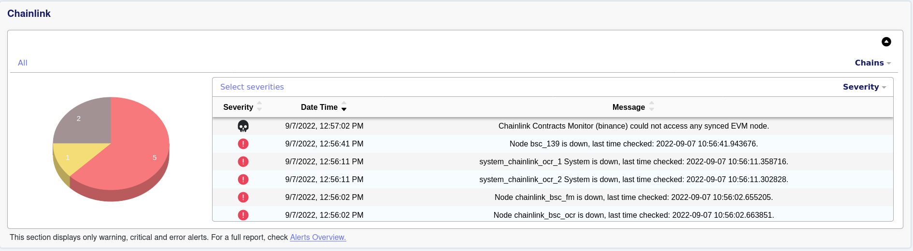
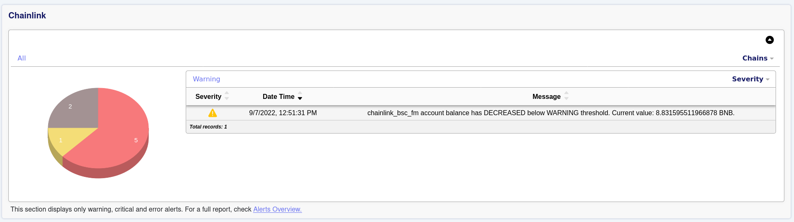
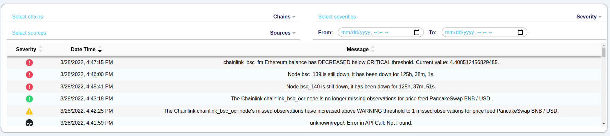
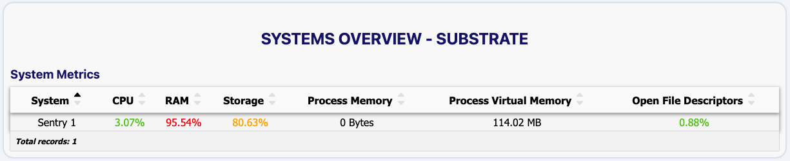

# PANIC UI Documentation
PANIC UI is developed on top of 
[Simply VC UI](https://www.npmjs.com/package/@simply-vc/uikit) and uses
[Stencil](https://stenciljs.com/) as a web component compiler. 

An overview of what the UI consists of can be seen [here](#pages).

## Running the UI for production
Docker is used to run the UI for production.
If you have already installed all the pre-requisites from the 
[main README](../README.md), you can run the UI by typing the following 
command from PANIC's root directory:

```bash
docker-compose up --build -d ui
```

**Note**: If you have already built and ran PANIC using `docker-compose up --build -d`, then the UI is already running.

## Running the UI for development
Running the UI in a development server triggers a rebuild when the src files are
updated. To run the UI in this mode, you need to perform the following steps:

1. Update `DEV_MODE` to true in the `.env` file.
2. Navigate to the PANIC root directory and do `docker-compose up --build -d 
   api` to run the API service. This will enable the UI service to successfully 
   obtain data.
3. `cd ui`
4. `npm install`
5. `npm start`

This will start the development server at `http://localhost:{API_PORT}`.

**Note**: Make sure to change back `DEV_MODE` to false in the `.env` file before
running PANIC in production.

## Running tests
Stencil uses [Jest](https://jestjs.io/) (a general Javascript testing framework)
to handle unit tests, while Jest+[Puppeteer](https://pptr.dev/) (a Node library 
which provide a high-level API to control Chromium) is used for E2E tests.

If you want to run the tests, navigate to the `/ui` directory and do the
following:

```bash
npm install           # Install project dependencies
npm test              # Run E2E and unit tests
```

The following commands can be used to run the E2E tests or the 
unit tests separately:

```bash
npm run test.spec     # Run unit tests
npm run test.e2e      # Run E2E tests
```

Additionally, the following command can be used to run the tests in watch mode, 
which watches files for changes and rerun all tests when something changes:

```bash
npm run test.watch    # Run E2E and unit tests in watch mode
```

## Pages
Currently, the UI consists of two pages: the [Home Page](#home-page) and
[Systems Overview](#systems-overview). Environmental variables such as `UI_PORT`
can be obtained from the .env file found in the root directory of PANIC. The 
default UI_PORT is `3333`.

### Home Page
This page can be accessed at `https://{UI_ACCESS_IP}:UI_PORT`.

The homepage consists of two sections: [Dashboard Overview](#dashboard-overview)
and [Alerts Overview](#alerts-overview).

#### Dashboard Overview
This section depicts an overview of all current problems in the node 
operator's set-up being monitored by PANIC. A pie chart is displayed for each 
base-chain (Cosmos, Substrate, Chainlink, General), showing the denomination of 
all problems for every sub-chain (ex. Polkadot, Regen, Binance Smart Chain) by 
severity. Problems in PANIC can be of three different severities; Critical, 
Warning and Error, thus the problems being displayed in this section have one of
these three severities. In addition to a pie chart, a table is displayed to show
more details about the current problems. Such details consist of a timestamp, 
description and severity.



For easier querying, the current problems can be filtered by sub-chains and 
severities, and sorted by severity, timestamp or description.



For all alerts, kindly use the [Alerts Overview](#alerts-overview) section.

#### Alerts Overview
This section displays all the alerts that have been raised by PANIC so far in a 
table. Each entry in the table consists of the alert severity, timestamp and 
message. The alerts can also be filtered by sub-chains, severities, sources and 
date-time, and sorted by severity, timestamp or message.



For active alerts, kindly use the [Dashboard Overview](#dashboard-overview) section.

### Systems Overview
The aim of this page is to show the system metrics (CPU usage, storage usage and
more) of a particular base-chain in a tabular way. Each metric value has the 
following colour coding:

- Green: If the metric value is not problematic
- Red: If the metric value is in a critical state
- Yellow: If the metric value is in a warning state

In addition to this, the node operator can also sort by the metric values.



This page can be accessed by clicking on the dropdown menu found in the 
right-hand side of the header, and choosing the desired base-chain.

## Known Issues
- Because of a known bug in the Firefox Browser, when accessing PANIC UI from 
  Firefox you must accept the certificates on both `https://{UI_ACCESS_IP}:UI_PORT` and
  `https://{UI_ACCESS_IP}:API_PORT`. More information regarding this issue can be found 
  [here](https://stackoverflow.com/questions/51831652/cors-request-across-different-ports-did-not-succeed-on-firefox-but-works-on-chro).

---
[Back to front page](../README.md)